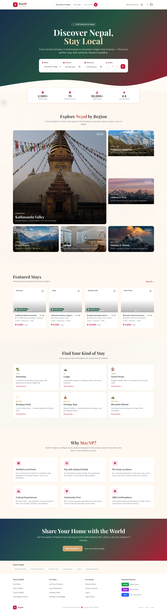
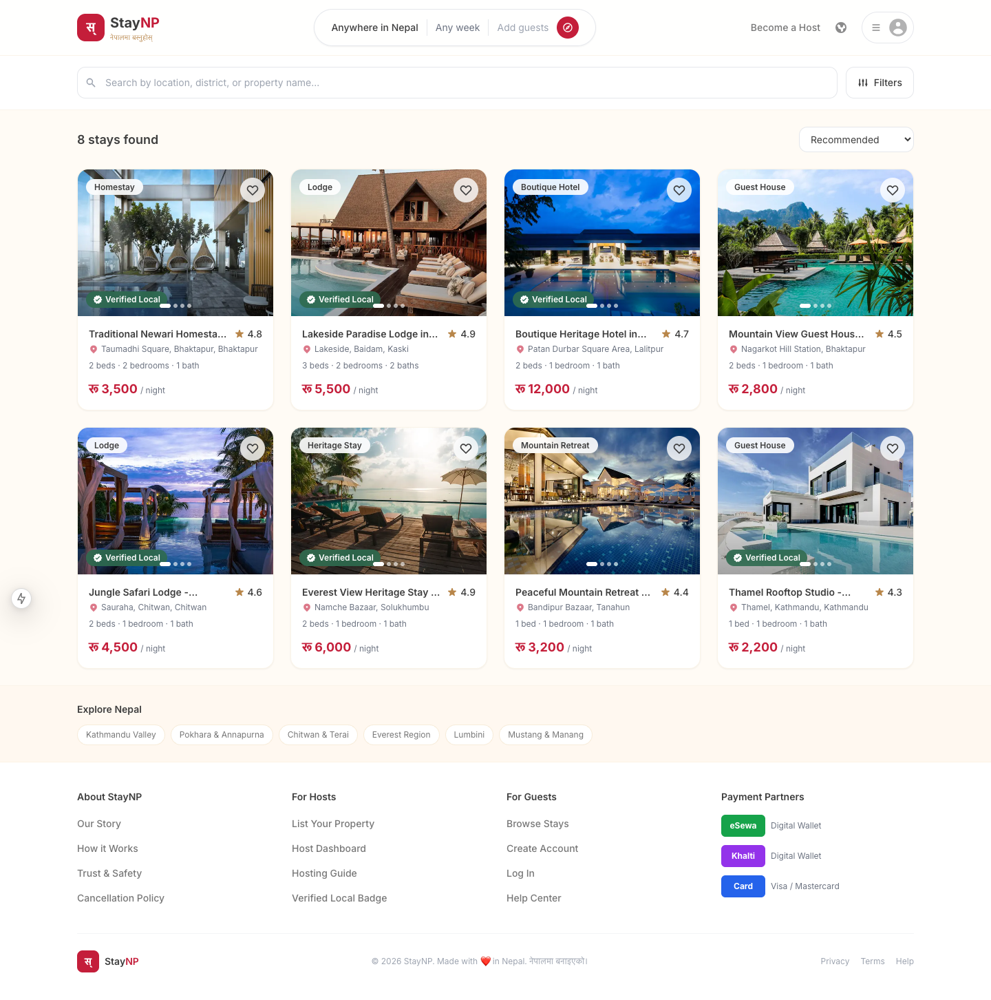
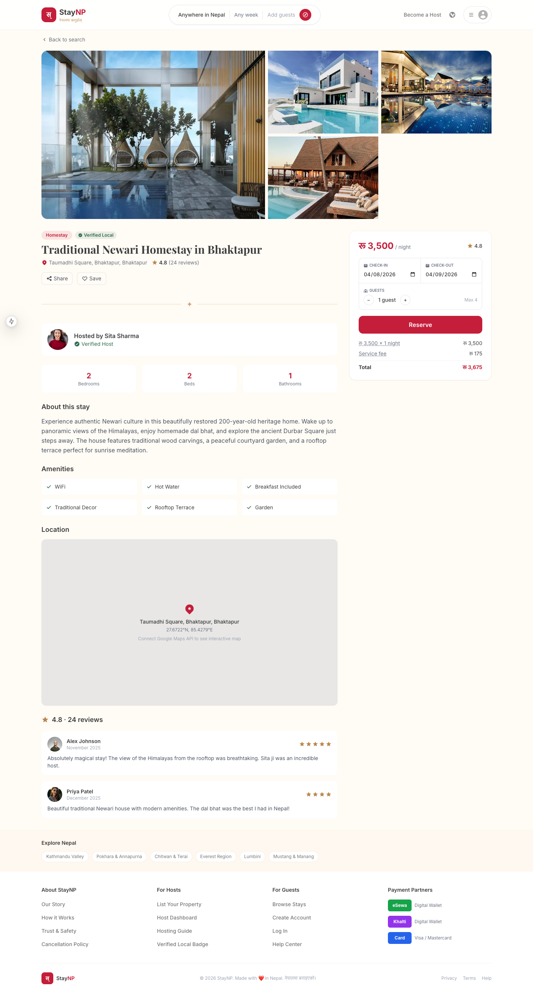
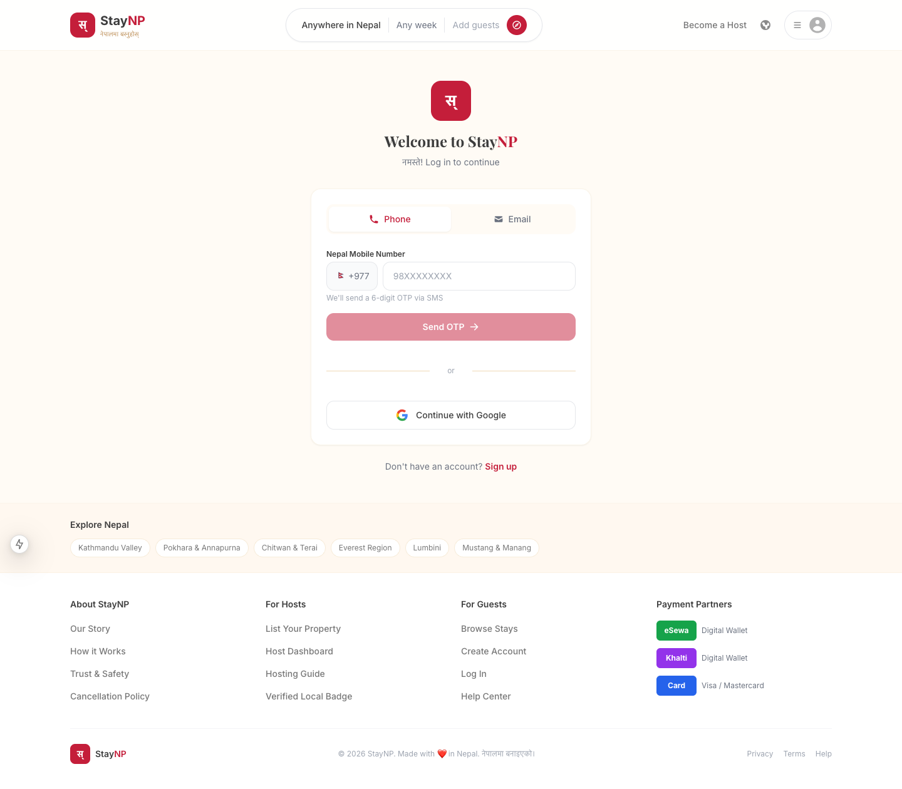
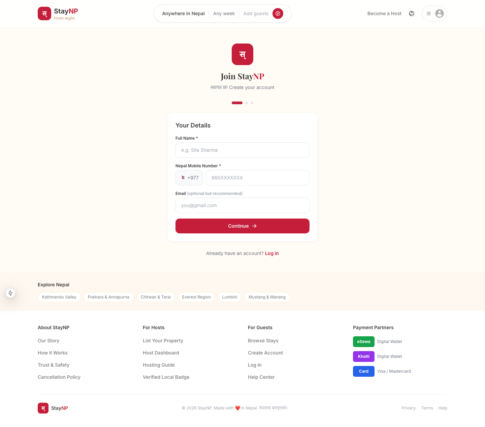
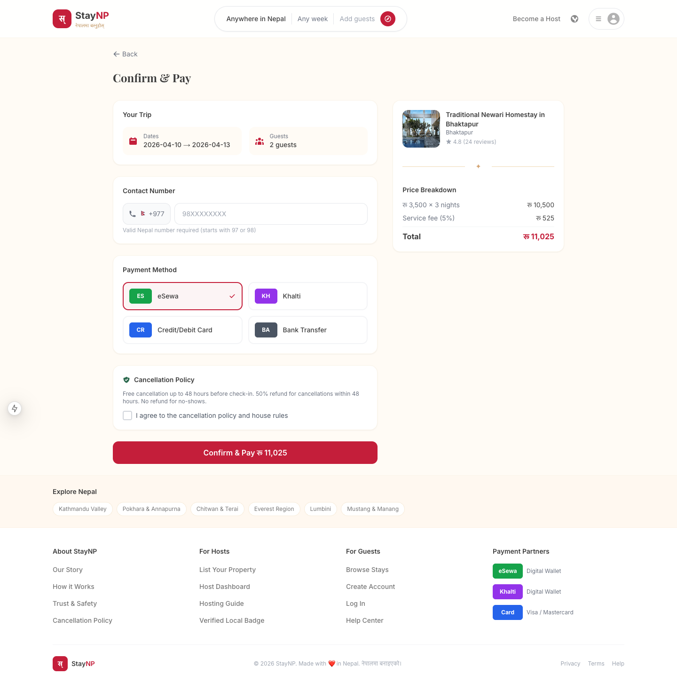
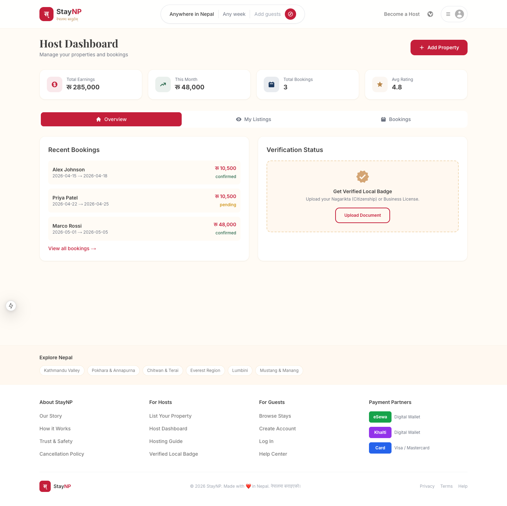
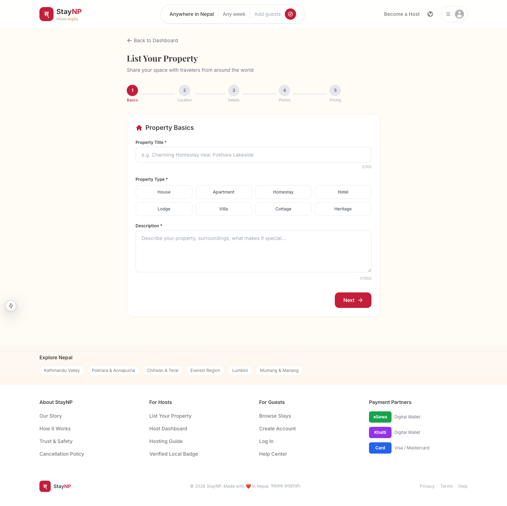

# StayNP — Discover Nepal, Stay Local 🇳🇵

**Nepal's own Airbnb.** A full-stack accommodation booking platform built for Nepal — with eSewa/Khalti payments, KYC-verified hosts, SMS confirmations, and authentic Nepali hospitality.

> नेपालमा बस्नुहोस् — *Stay in Nepal*

### 🌐 [Checkout the live demo → staynp.vercel.app](https://staynp.vercel.app/)

---

## Screenshots

### Homepage
The hero section with search, region explorer with real Nepal photos, featured stays, and property type browser.



### Property Listings
Browse all stays with search bar, filters (type, price, amenities), sorting, and property cards with image carousels.



### Property Detail
Full photo gallery, host info, amenities, location, reviews, and booking widget with date/guest selection.



### Login
Nepal phone OTP verification (validates 97/98 prefix, detects NTC/Ncell) and email login with verification code.



### Signup
Multi-step registration with phone verification, password strength meter, and terms acceptance.



### Booking & Payment
Complete booking flow with contact validation, payment method selection (eSewa, Khalti, Card), price breakdown, and confirmation.



### Host Dashboard
Manage listings, accept/reject bookings, track earnings, and upload KYC documents for verification.



### Create New Listing
5-step property creation with photo upload (gallery + camera), drag & drop, amenity selection, and pricing.



---

## What is StayNP?

StayNP connects travelers with verified local stays across all 75 districts of Nepal. From heritage homes in Bhaktapur to mountain lodges near Everest, we make it easy to discover authentic Nepali accommodations.

**Why StayNP over Airbnb?**
- Pay with **eSewa & Khalti** — no international cards needed
- **KYC-verified hosts** with Nagarikta/Business License verification
- **SMS booking confirmations** — works even without internet
- Prices in **NPR (Nepali Rupees)** with transparent 5% service fee
- Hosts keep **95%** of every booking
- Nepal phone number login with **OTP verification**

---

## Features

### For Guests
- **Search & Filter** — Browse stays by region, district, property type, price, and amenities
- **Real Photos** — Image carousel with full-screen gallery modal
- **Instant Booking** — Select dates, guests, and pay securely
- **Multiple Payment Methods** — eSewa, Khalti, Credit/Debit Card, Bank Transfer
- **Phone Login** — Nepal mobile number (NTC/Ncell) with OTP verification
- **Email Login** — With email verification code
- **Wishlist** — Save favorite properties
- **Reviews** — Read reviews from verified guests

### For Hosts
- **Easy Listing** — 5-step property creation with photo upload (gallery + camera)
- **Host Dashboard** — Manage listings, bookings, earnings
- **Accept/Reject Bookings** — Full booking management
- **KYC Verification** — Upload Nagarikta or Business License for Verified Local badge
- **Earnings Tracker** — See total and monthly earnings
- **Listing Controls** — Activate, deactivate, edit, or delete listings

### Security & Validation
- **Nepal phone validation** — Only valid 97/98 prefix, 10-digit numbers accepted
- **Carrier detection** — Automatically detects NTC, Ncell
- **Password strength meter** — Real-time scoring with suggestions
- **Email validation** — Blocks disposable email domains
- **Input sanitization** — XSS prevention on all user inputs
- **Rate limiting** — Prevents brute-force OTP/login attempts
- **Image validation** — File type (JPG/PNG/WebP) and size (10MB) checks

### All Pages
| Page | Description |
|------|-------------|
| `/` | Homepage with hero, region explorer, featured stays, property types |
| `/properties` | Browse all stays with search, filters, and sorting |
| `/properties/[id]` | Property detail with gallery, reviews, booking widget |
| `/auth/login` | Phone OTP + Email verification login |
| `/auth/signup` | Multi-step signup with phone verification & password strength |
| `/booking/[id]` | Booking flow with payment selection and confirmation |
| `/host` | Host dashboard with stats, listings, bookings management |
| `/host/new` | 5-step property listing creation |
| `/about` | About StayNP with mission, how it works, trust & safety |
| `/help` | Help center with searchable FAQ (25+ questions, 6 categories) |
| `/hosting-guide` | Complete hosting guide with earnings estimates |
| `/privacy` | Privacy policy |
| `/terms` | Terms of service |

---

## Tech Stack

| Layer | Technology |
|-------|-----------|
| **Framework** | Next.js 15 (App Router) |
| **Language** | TypeScript |
| **Styling** | Tailwind CSS with custom Nepali theme |
| **UI** | React 19, react-icons, react-hot-toast |
| **Backend** | Next.js API Routes + Prisma ORM (SQLite → Postgres) |
| **Auth** | Custom JWT sessions (httpOnly cookie) + bcryptjs |
| **OTP** | Phone (Aakash SMS) + Email (Nodemailer / any SMTP) |
| **Payments** | eSewa API + Khalti API (server-verified, DB-backed) |
| **Validation** | Zod |
| **Fonts** | Inter, Playfair Display |

---

## Getting Started

### Prerequisites
- Node.js 18+
- npm or yarn

### Installation

```bash
# Clone the repo
git clone https://github.com/Diwakarmahatosudi/staynp.git
cd staynp

# Install dependencies (generates Prisma Client automatically)
npm install

# Set up environment variables
cp .env.local.example .env.local
# Also copy the DATABASE_URL into a root .env so the Prisma CLI can see it:
echo 'DATABASE_URL="file:./dev.db"' > .env

# Create the SQLite database + schema
npm run db:push

# (Optional) seed demo hosts, properties, and a guest account
npm run db:seed

# Run the dev server
npm run dev
```

**Seeded demo accounts** (password is `Password123` for all):

| Role  | Email               | Phone      |
|-------|---------------------|------------|
| Host  | sita@example.com    | 9841234567 |
| Host  | ram@example.com     | 9851234567 |
| Guest | guest@example.com   | 9801234567 |

**Dev OTPs**: if you don't set up SMTP or Aakash SMS, every OTP code is printed to the Next.js terminal so you can copy-paste it during sign-in/sign-up.

Open [http://localhost:3000](http://localhost:3000) in your browser.

### Environment Variables

See `.env.local.example` for the full list. The essentials:

```env
# Database (SQLite for dev, switch to postgres:// for prod)
DATABASE_URL="file:./dev.db"

# Long random string — used to sign JWT session tokens
JWT_SECRET="change-me-to-a-long-random-secret"

# Public app URL (used for payment redirects)
NEXT_PUBLIC_APP_URL=http://localhost:3000

# SMTP for email OTP + booking emails (optional in dev)
SMTP_HOST=
SMTP_PORT=587
SMTP_USER=
SMTP_PASS=
SMTP_FROM="StayNP <no-reply@staynp.local>"

# Aakash SMS for phone OTP (optional in dev)
AAKASH_SMS_TOKEN=

# eSewa / Khalti (required for real payment testing)
ESEWA_MERCHANT_CODE=EPAYTEST
ESEWA_SECRET_KEY="8gBm/:&EnhH.1/q"
NEXT_PUBLIC_ESEWA_PAYMENT_URL=https://rc-epay.esewa.com.np/api/epay/main/v2/form
KHALTI_SECRET_KEY=
```

### Database & Prisma

The schema lives at `prisma/schema.prisma` (SQLite by default so it works out-of-the-box).

```bash
npm run db:push      # create/update the database to match the schema
npm run db:studio    # open Prisma Studio (visual DB browser)
npm run db:seed      # insert demo hosts / properties / guest
npm run db:reset     # nuke and re-create with fresh seed data
```

Switch to Postgres by setting `DATABASE_URL=postgresql://...` and changing `provider = "postgresql"` in `prisma/schema.prisma`, then run `npm run db:push`.

### API Routes (backend)

All backend logic is built on Next.js API routes — no external backend needed.

| Route | Purpose |
|-------|---------|
| `POST /api/auth/signup` | Create account (phone + optional email), send OTP |
| `POST /api/auth/login` | Password login, or OTP login (set `method: "otp"` + `code`) |
| `POST /api/auth/send-otp` | Send a 6-digit OTP via SMS or email |
| `POST /api/auth/verify-otp` | Verify OTP for signup/login/verify |
| `POST /api/auth/reset-password` | Reset password using an OTP |
| `GET  /api/auth/me` | Get the currently logged-in user |
| `POST /api/auth/logout` | End current session |
| `GET  /api/properties` | Search/list active properties |
| `POST /api/properties` | Host: create listing |
| `GET  /api/properties/:id` | Get one listing with reviews |
| `PATCH /api/properties/:id` | Host: update own listing |
| `DELETE /api/properties/:id` | Host: delete own listing |
| `GET  /api/bookings?role=guest\|host` | List bookings for current user |
| `POST /api/bookings` | Create a booking (enforces date conflicts) |
| `GET  /api/bookings/:id` | Booking detail (guest or host) |
| `PATCH /api/bookings/:id` | Update status (confirm / cancel / complete) |
| `POST /api/payment/esewa` | Initiate eSewa payment for a booking |
| `GET  /api/payment/esewa?action=verify` | eSewa success callback (server-verified) |
| `POST /api/payment/khalti` | Initiate Khalti payment |
| `GET  /api/payment/khalti?action=verify` | Khalti success callback (server-verified) |
| `GET  /api/reviews?property_id=…` | List reviews for a property |
| `POST /api/reviews` | Leave a review (only for guests who stayed) |
| `POST /api/upload` | Upload property images (saved to `/public/uploads/`) |

A typed fetch helper for the frontend is exported from `lib/api-client.ts` as `api.auth.*`, `api.properties.*`, `api.bookings.*`, `api.payments.*`, and `api.reviews.*`.

---

## Project Structure

```
staynp/
├── app/                         # Next.js App Router pages
│   ├── page.tsx                 # Homepage
│   ├── layout.tsx               # Root layout with Navbar, Footer, Toaster
│   ├── globals.css              # Tailwind + custom Nepali theme
│   ├── about/                   # About page
│   ├── help/                    # Help center with FAQ
│   ├── hosting-guide/           # Hosting guide
│   ├── privacy/                 # Privacy policy
│   ├── terms/                   # Terms of service
│   ├── auth/                    # Login, Signup, OAuth callback
│   ├── properties/              # Property listing & detail
│   ├── booking/                 # Booking & payment flow
│   ├── host/                    # Host dashboard & new listing
│   └── api/                     # API routes (booking, payment, SMS)
├── components/                  # Reusable React components
├── lib/                         # Utilities & backend helpers
│   ├── db.ts                    #   Prisma client singleton
│   ├── auth.ts                  #   JWT sessions, OTP, password hashing
│   ├── email.ts                 #   Nodemailer + OTP/email templates
│   ├── sms.ts                   #   Aakash SMS + dev console fallback
│   ├── esewa.ts / khalti.ts     #   Payment gateway helpers
│   ├── validation.ts            #   Nepal phone/email/password validators
│   └── api-client.ts            #   Typed fetch wrapper for the frontend
├── types/                       # TypeScript interfaces & constants
├── prisma/                      # Prisma schema + seed script
│   ├── schema.prisma
│   └── seed.ts
└── screenshots/                 # Website screenshots
```

---

## Design Theme

Custom Tailwind color palette inspired by Nepal:

| Color | Hex | Usage |
|-------|-----|-------|
| Nepal Crimson | `#C41E3A` | Primary buttons, accents, logo |
| Nepal Gold | `#D4A574` | Decorative elements, badges |
| Nepal Forest | `#2D6A4F` | Success states, verified badges |
| Nepal Mountain | `#1E3A5F` | Dark backgrounds, gradients |
| Nepal Sand | `#FAF7F2` | Page backgrounds |

---

## Author

**Diwakar Mahato Sudi**

---

<p align="center">
  Made with ❤️ in Nepal<br/>
  <strong>नेपालमा बनाइएको</strong>
</p>
